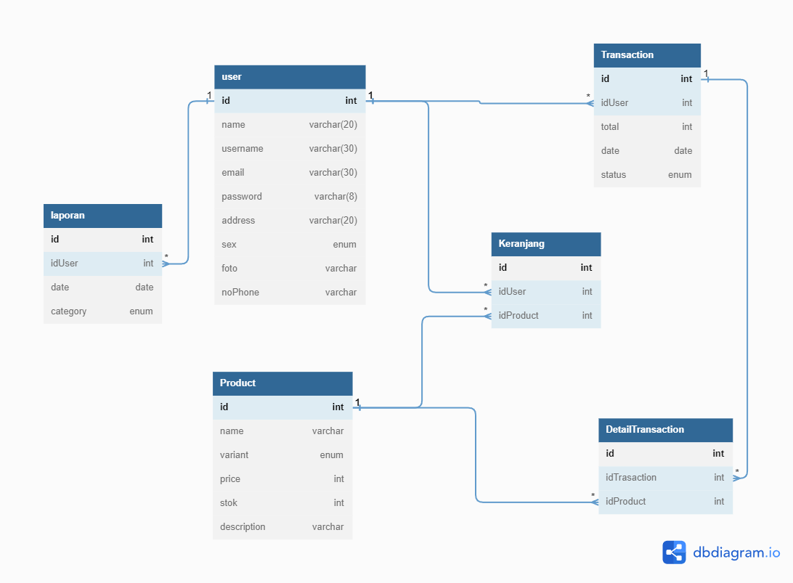

# E-Commers

Application Programing Interface for E-commers

## Link Deploy

[Raywal App](https://e-commerce-production-9d8e.up.railway.app/)

## End Point

## ERD



---

## Get Started

- Please set config database with your environment

- Install depedencies

```bash
npm install
```

- Create database

```bash
npm run make
```

- Create table

```bash
npm run migrate
```

---

## Contract API

### Transaction

POST /transaction

- Request:

```json
Header: userId
{
  "list_id_product": [
    {
        "id": 1,
        "count": 2,
        ""
    },
    {
        "id": 1,
        "count": 2,
    },
  ]
}
```

- Response:

```json
{
  "status": "Success",
  "data": {
    "idTransaction": 1,
    "idUser": 1,
    "count": 200000,
    "productItems": [
      {
        "idProduct": 1,
        "name": "arabica latte",
        "price": 25000,
        "variat": "arabica"
      },
      {
        "idProduct": 1,
        "name": "arabica latte",
        "price": 25000,
        "variat": "arabica"
      },
      {
        "idProduct": 1,
        "name": "arabica latte",
        "price": 25000,
        "variat": "arabica"
      }
    ]
  }
}
```
